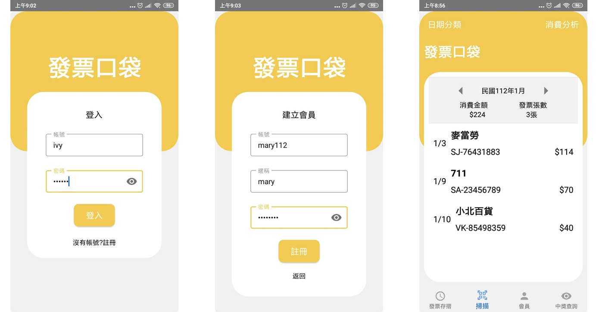
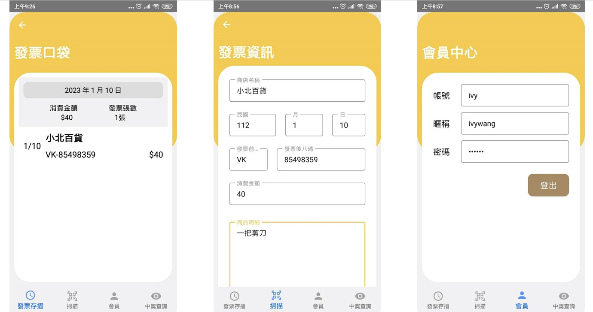
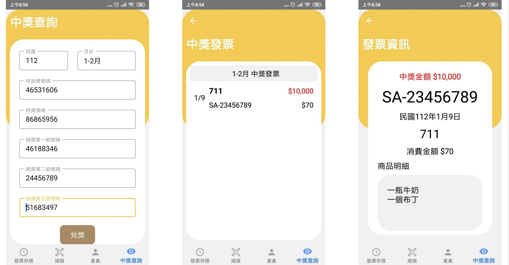

# ReceiptPocket

## 功能
- 登入 & 登出
  - 登入：將該帳戶遠端資料庫的發票資料同步至手機資料庫
  - 登出：將該帳戶手機資料庫的發票資料同步至遠端資料庫
  - 其餘的資料操作皆在手機資料庫上進行
  - 登入後重新打開App會保留在登入狀態，直到按下登出鍵
- 根據指定的月份或日期查看持有發票
- 手動新增、修改 & 刪除發票資訊
- 根據輸入的中獎資訊進行中獎比對，並呈現結果

## 使用技術
- 語言：Kotlin
- 架構：MVP
- 資料庫：MySQL、JDBC、Room

## 畫面

## 待加項目
- Unit Test
- QRCode掃描器
- 購物分析
- 根據關鍵字搜尋發票
- 自動導入中獎號碼
